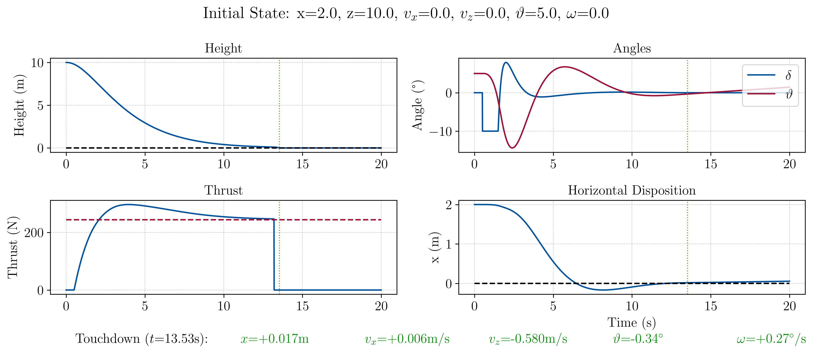
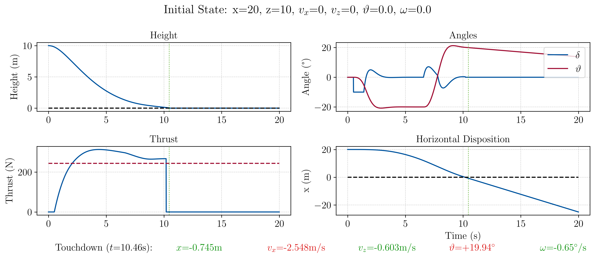
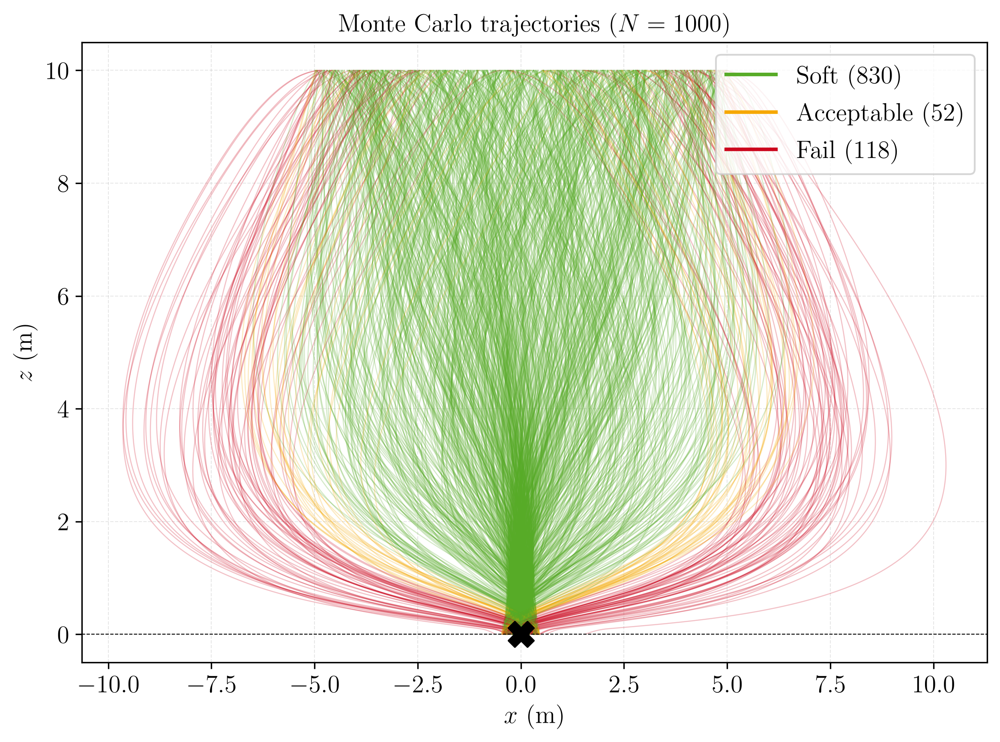
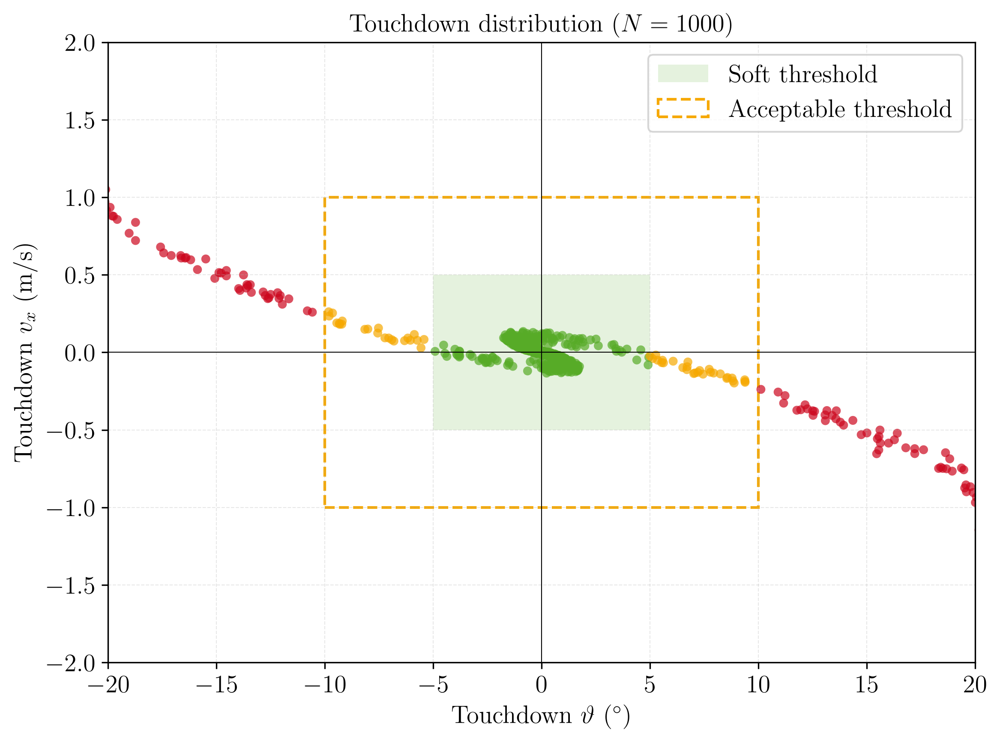
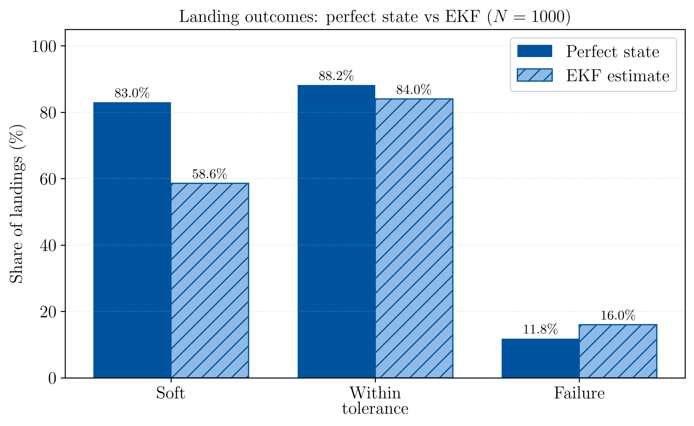

# Lunar Hopper: Closed-Loop Control and Navigation

A 2D descent control and navigation study for a lunar hopper. A single gimbaled
thruster has to bring the vehicle down from 10 m and set it on a target, upright
and slow. The code does the rigid-body dynamics with an RK4 propagator, a cascaded
PD controller, an Extended Kalman Filter that estimates the state from noisy
sensors, and a Monte Carlo run over random initial conditions to see how often the
landing works.

## Physics

The state is $\vec q = (x, z, \dot x, \dot z, \vartheta, \omega)$: lateral position,
altitude, their rates, the body tilt $\vartheta$ from vertical, and the tilt rate
$\omega$. The thrust $T$ acts at the base of the vehicle through a gimbal angle
$\delta$. For a rigid body this gives

$$
m\ddot x = T\sin(\vartheta+\delta), \qquad
m\ddot z = T\cos(\vartheta+\delta) - mg, \qquad
I\ddot\vartheta = \ell\, T\sin\delta
$$

with gimbal-to-centre-of-mass distance $\ell = h/2$ and moment of inertia
$I = \frac{1}{12}m(3r^2 + h^2)$. The parameters are $m = 150$ kg, $g = 1.625$ m/s²,
$h = 2$ m, $r = 0.25$ m. The inputs are the thrust $T \ge 0$ and the gimbal $\delta$,
integrated with RK4 at $\Delta t = 0.01$ s from a release altitude $z_0 = 10$ m. Mass
is held constant, so propellant depletion is not in the model.

The vehicle is underactuated: two inputs, three degrees of freedom. Neither $T$ nor
$\delta$ pushes the vehicle sideways on its own, so the only way to move sideways is
to tilt the body and use the sideways part of the thrust. That coupling is the thing
that makes the control interesting.

Before anything else I checked the propagator against two cases with known answers.
With the engine off the vehicle free-falls to the ground at $t = \sqrt{2 z_0 / g} =
3.508$ s (the run reports 3.51 s, the first step after $z$ crosses zero). Holding
hover thrust $T = mg$ keeps the altitude fixed. The engine is cut below 0.10 m, so
the last stretch is a free fall that hits at about $\sqrt{2 g (0.1)} \approx 0.57$ m/s.

## Control

The controller is three nested PD loops. An altitude loop sets the thrust to control
the descent. An outer lateral loop takes the horizontal-position error and turns it
into a commanded tilt $\vartheta_{\mathrm{cmd}} = -K_{p,x}\,x - K_{d,x}\,\dot x$. A
fast inner attitude loop drives the body to that tilt with the gimbal. The inner loop
runs five times faster than the outer one (ω<sub>n</sub> = 2.5 against 0.5 rad/s), so
the two can be tuned separately.

Close to vertical and near hover, each loop is just a damped double integrator,

$$
\ddot z + 2\zeta\omega_n\,\dot z + \omega_n^2\,z = 0,
\qquad \omega_n^2 = \frac{K_p}{m}, \qquad 2\zeta\omega_n = \frac{K_d}{m}.
$$

The lateral and attitude loops are the same but with $m$ replaced by $m/T$ and
$I/(\ell T)$. Those depend on the current thrust, so the lateral and attitude gains
are scheduled on $T$ to keep ω<sub>n</sub> and ζ fixed; the altitude loop keeps fixed gains.
I use PD because dropping the derivative term leaves an undamped oscillator that never
settles, and I leave out the integral term because the idealised model has no steady
bias to cancel. The altitude loop is critically damped (ζ = 1), since an overshoot
there can mean hitting the ground. The lateral and attitude loops use ζ = 0.7, where
a small overshoot is fine and the faster response matters, since the offset has to be
removed before touchdown.

| Loop | States | Output | ω<sub>n</sub> (rad/s) | ζ | Limits |
|---|---|---|---|---|---|
| Altitude | z, ż | thrust T | 0.5 | 1.0 | T ≥ 0 |
| Lateral (outer) | x, ẋ | tilt cmd θ<sub>cmd</sub> | 0.5 | 0.7 | ±20° |
| Attitude (inner) | θ, ω | gimbal δ | 2.5 | 0.7 | ±10° |

The commanded tilt saturates at ±20° and the gimbal at ±10°.

## Navigation

The controller above is given the true state, which a real vehicle does not have. The
navigation layer adds sensors and an Extended Kalman Filter that reconstructs the four
translational states $(x, z, \dot x, \dot z)$; attitude is taken as known. There are
two sensors: an accelerometer read every step, which senses the thrust acceleration
(not gravity) plus noise, and an altimeter read once every 0.2 s, which measures
altitude plus noise.

The filter keeps a mean and a covariance and updates them in two steps. The predict
step dead-reckons on the accelerometer: it moves the mean forward with the measured
acceleration and grows the covariance to account for the noise and the imperfect
model. The update step runs when an altimeter fix comes in: it compares the altitude
the filter expected with what the altimeter read, moves the mean toward the
measurement by an amount set by the relative uncertainties, and shrinks the
covariance.

Two things matter for the results. With attitude known the dynamics and the
measurement are both linear in the estimated state, so the EKF here is really a linear
Kalman filter, written in the general form but no more than that. And the altimeter
only sees altitude, so horizontal position is never measured directly. It is
dead-reckoned from the accelerometer and drifts with any error in the initial
velocity, which turns out to be where most of the error comes from.

## Results

### Single descents

<p align="center"></p>

A working case ($x_0 = 2$ m, $\vartheta_0 = 5^\circ$). The thrust sits at zero at first:
the lander starts above the target altitude, so the altitude loop would ask for
downward thrust, which clips to zero, and gravity does the early descent for free.
Once the thrust comes up the gimbal tilts the body to remove the offset and only
straightens it out once the offset is gone, so the vehicle is upright last. It touches
down at $t = 13.5$ s with $x = +0.02$ m, $v_z = -0.58$ m/s and $\vartheta = -0.3^\circ$, a
soft landing, and there is no overshoot in $z$.

<p align="center"></p>

A failing case ($x_0 = 20$ m, twice the release height). The commanded tilt saturates
at -20° to recover the offset. The controller does drive $x$ back toward zero, but the
recovery takes longer than the descent, so the lander is still leaning at touchdown
($\vartheta \approx +20^\circ$, $v_x \approx -2.5$ m/s) and crashes. What sets the failure
is how large an offset can be recovered in the time available, not how large the
initial tilt is.

### Monte Carlo

<p align="center">
  
  
</p>

Over $N = 1000$ descents with dispersed initial conditions ($x_0 \in [-5, 5]$ m,
$\dot x_0 \in [-2, 2]$ m/s, $\dot z_0 \in [-3, 0]$ m/s, $\vartheta_0 \in [-10^\circ, 10^\circ]$,
$\omega_0 \in [-3^\circ, 3^\circ]$/s), flying on the true state gives 830 soft landings (83.0%,
with $|x| < 0.5$ m, $|v_x| < 0.5$ m/s, $|v_z| < 1$ m/s, $|\vartheta| < 5^\circ$), 882 within
tolerance overall (88.2%, soft or acceptable), and 118 failures (11.8%), all out-of-tolerance
touchdowns with no timeouts. The touchdown scatter shows the lateral velocities
staying inside $|v_x| < 1$ m/s while the failures sit at touchdown tilt above 10°. That
tilt comes from large initial lateral offsets, not from large initial tilts: an offset
needs a sustained tilt to null it, and that tilt is not always straightened out in time.

### Flying on the estimate

<p align="center"></p>

Running the same 1000 descents on the EKF estimate instead of the truth, the soft rate
drops from 83.0% to 58.6% while the within-tolerance rate barely changes, 88.2% to
84.0%. The reason is what the sensors can see. The altimeter holds the vertical channel,
so the descent and the cutoff timing are about the same and few landings fall out of
tolerance. Horizontal position is not measured, so it drifts, and that drift pushes
tight soft landings into the wider acceptable band. The estimate-versus-truth run shows
this directly: $z$, $\dot x$ and $\dot z$ track well, and only $x$ keeps a small bias.
The filter is statistically consistent (over 300 descents the 4-state NEES is 4.0 and
the altimeter NIS is 1.0, both inside their 95% bands), so this is not a tuning
problem. It is the cost of never measuring horizontal position.

## Running it

```bash
python3 -m venv .venv
source .venv/bin/activate
pip install -r requirements.txt
python Hopper.py
```

`python Hopper.py` runs the propagator checks, the two example descents, the
$N = 1000$ Monte Carlo campaign, the perfect-state-versus-EKF comparison over the same
dispersions, and the NEES/NIS consistency check. Everything is seeded, so the numbers
repeat. Figures go to `Plots/` as PNG (used above) and PDF, and the Monte Carlo
touchdown tables go to `Data/` as CSV. LaTeX text rendering is used if a system install
is on `PATH`, otherwise matplotlib's built-in mathtext is used.

Dependencies: Python 3, NumPy and matplotlib (see `requirements.txt`).

`Lunar_Hopper_Report.pdf` is a longer write-up of the whole study; its source is
`Lunar_Hopper_Report.tex`.

## License

MIT. See [LICENSE](LICENSE).
