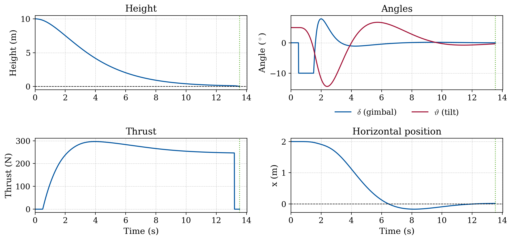
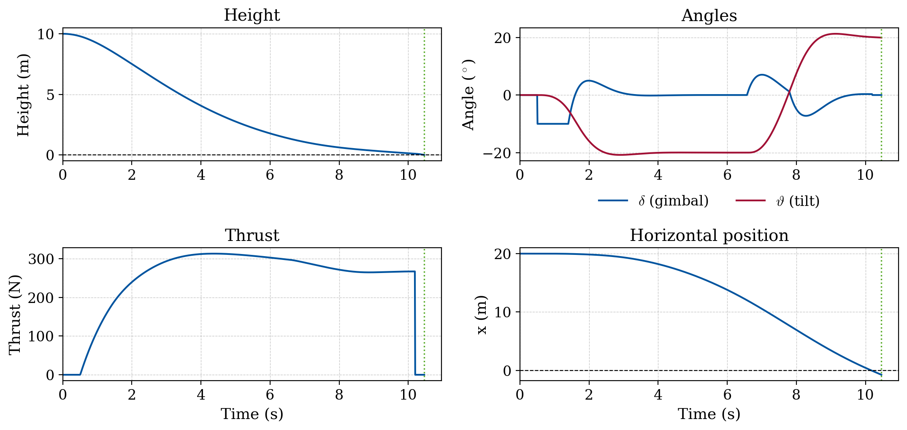
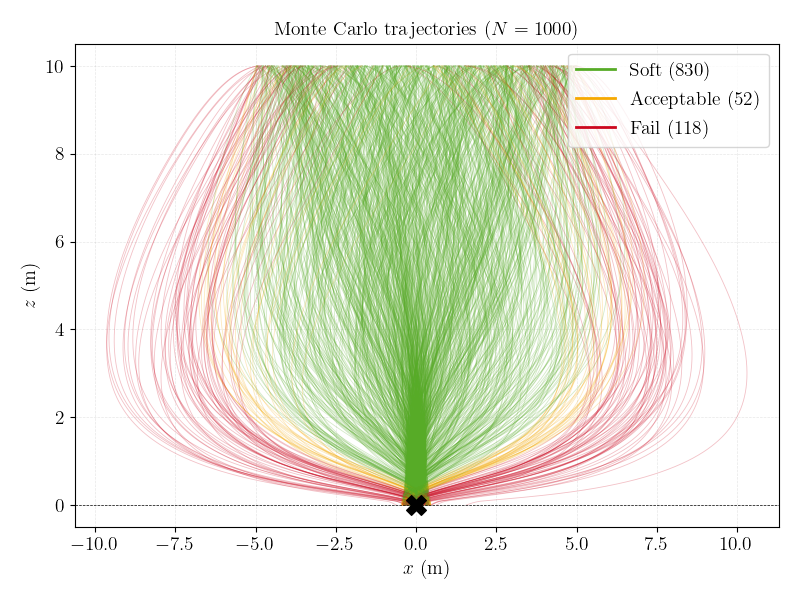
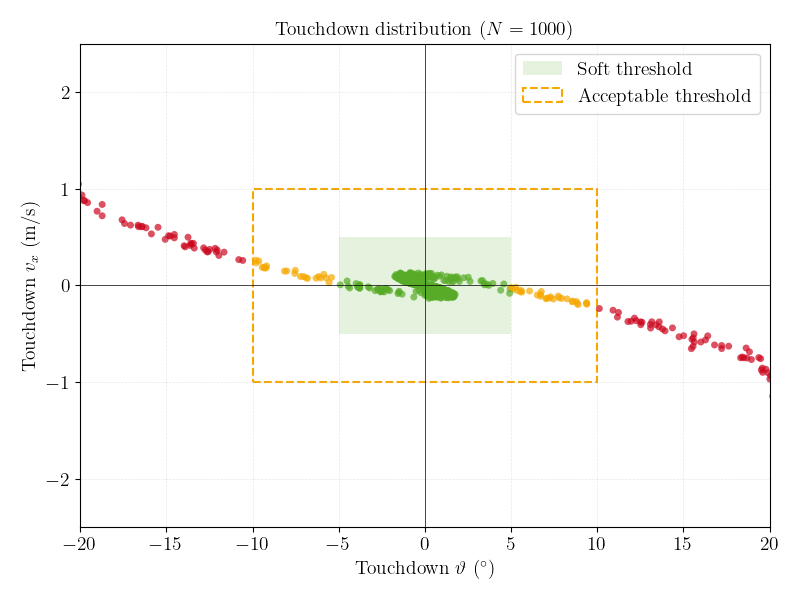

# Lunar Hopper: Closed-Loop Guidance & Navigation

Tamilarasan Ketheeswaran

A 2D descent guidance and control study for a lunar hopper. RK4 propagator, cascaded PD guidance/control, Monte Carlo dispersion analysis. Started as a short study to build intuition for closed-loop landing guidance under uncertain initial conditions. Now growing toward optimization-based guidance, full 6-DOF attitude dynamics, and state estimation.

## Status

**Implemented:**
- 2D planar dynamics (translation + pitch), RK4 propagator
- Cascaded PD guidance/control (altitude → lateral → attitude), gain-scheduled
- Monte Carlo dispersion analysis over initial conditions

**Planned:**
- Convex (fuel-optimal) powered descent guidance via lossless convexification (Açıkmeşe & Ploen, 2007), solved as a second-order cone program, with propellant use and landing dispersion compared directly against the PD baseline over the same Monte Carlo campaign
- 6-DOF rigid-body dynamics with quaternion kinematics and a thruster/gimbal allocation layer, so the convex guidance's thrust-pointing constraint is meaningful rather than decorative
- An Extended Kalman Filter for navigation (state knowledge is currently assumed perfect)

## Setup

```bash
cd "Hopper Project"
python3 -m venv .venv
source .venv/bin/activate
pip install -r requirements.txt
```

## Run

```bash
python Hopper.py
```

Runs two demo scenarios (a working and a failing landing), then the full `N=1000` Monte Carlo campaign, seeded and reproducible with `seed=42` by default. Figures are written to `output/` (gitignored, regenerated on every run) and shown interactively. LaTeX rendering is used if a system install is found on `PATH`, otherwise it falls back to matplotlib's built-in mathtext.

## Model

The state is $\vec q=(x,z,\dot x,\dot z,\vartheta,\omega)$: lateral position, altitude, their rates, body tilt $\vartheta$ from vertical, and tilt rate $\omega$. Thrust $T$ acts at the base through gimbal angle $\delta$. A Newton-Euler treatment of the rigid body gives

$$
m\ddot x = T\sin(\vartheta+\delta), \qquad
m\ddot z = T\cos(\vartheta+\delta)-mg, \qquad
I\ddot\vartheta = \ell\,T\sin\delta
$$

with $\ell=h/2$ and $I=\tfrac{1}{12}m(3r^2+h^2)$.

**Parameters:** $m=150~\mathrm{kg}$, $g=1.625~\mathrm{m/s^2}$, $h=2~\mathrm{m}$, $r=0.25~\mathrm{m}$. The inputs are $T\ge 0$ and $\delta$; the equations are integrated with RK4 ($\Delta t=0.01~\mathrm{s}$) from $z_0=10~\mathrm{m}$. The propagator was checked against two limits first: free fall reaches the surface at $t\approx3.51~\mathrm{s}=\sqrt{2z_0/g}$, and setting hover thrust $T=mg$ holds altitude. Propellant mass depletion isn't modeled. Vehicle mass stays constant for the whole descent.

## Controller

The vehicle is underactuated: two inputs for three degrees of freedom. Neither the thrust $T$ nor the gimbal $\delta$ produces a horizontal force directly, so lateral motion is only possible by tilting the body and using the horizontal component of thrust. Guidance is split into three nested single-input loops: an **altitude** loop that sets the thrust to control the descent, an outer **lateral** loop that turns horizontal-position error into a commanded tilt $\vartheta_{\mathrm{cmd}}$, and a fast inner **attitude** loop that drives the body to that tilt through the gimbal, five times faster than the outer loop ($\omega_{n,\vartheta}=2.5$ vs. $\omega_{n,x}=0.5~\mathrm{rad/s}$).

Linearised about the vertical, near-hover condition, each loop reduces to a PD-damped double integrator:

$$
\ddot z + 2\zeta\omega_n\,\dot z + \omega_n^2\,z = 0,
\qquad \omega_n^2 = \frac{K_p}{m}, \qquad 2\zeta\omega_n = \frac{K_d}{m}
$$

The lateral and attitude loops take the identical form, but with gain prefactor $m$ replaced by $m/T$ and $I/(\ell T)$ respectively. Since that depends on instantaneous thrust, those two loops are **gain-scheduled** on $T$, while the altitude loop uses fixed gains. The altitude loop is critically damped ($\zeta=1$): even one overshoot risks hitting the ground on the way down. The lateral and attitude loops use $\zeta=0.7$ for a faster response, since their offsets need to be nulled out before touchdown.

| Loop | States | Output | $\omega_n$ (rad/s) | $\zeta$ | Limits |
|---|---|---|---|---|---|
| Altitude | $z,\dot z$ | thrust $T$ | 0.5 | 1.0 | $T \ge 0$ |
| Lateral (outer) | $x,\dot x$ | tilt cmd $\vartheta_{\mathrm{cmd}}$ | 0.5 | 0.7 | $\pm 20^\circ$ |
| Attitude (inner) | $\vartheta,\omega$ | gimbal $\delta$ | 2.5 | 0.7 | $\pm 10^\circ$ |

Commanded tilt and gimbal are saturated at the limits above. The engine cuts off below $0.10~\mathrm{m}$ altitude, giving a final free-fall touchdown speed of $\approx 0.57~\mathrm{m/s}$.

## Results

<p align="center">
  
  
</p>

**Left, working case** ($x_0=2~\mathrm{m}$, $\vartheta_0=5^\circ$): touchdown at $t=13.5~\mathrm{s}$ with $x=+0.02~\mathrm{m}$, $v_z=-0.58~\mathrm{m/s}$, $\vartheta=-0.3^\circ$, a soft landing. **Right, failing case** ($x_0=20~\mathrm{m}$): the commanded tilt saturates at $-20^\circ$ to recover the large offset, and the recovery maneuver outlasts the descent. Touchdown at $\vartheta\approx+20^\circ$, $v_x\approx-2.5~\mathrm{m/s}$: a crash.

<p align="center">
  
  
</p>

**Monte Carlo, $N=1000$** ($x_0\in[-5,5]~\mathrm{m}$, $\dot x_0\in[-2,2]~\mathrm{m/s}$, $\dot z_0\in[-3,0]~\mathrm{m/s}$, $\vartheta_0\in[-10^\circ,10^\circ]$, $\omega_0\in[-3^\circ,3^\circ]$/s): **830 (83.0%) soft landings** ($|x|<0.5~\mathrm{m}$, $|v_x|<0.5~\mathrm{m/s}$, $|v_z|<1~\mathrm{m/s}$, $|\vartheta|<5^\circ$), **882 (88.2%) within the looser acceptable tolerance**, **118 (11.8%) failures**, all out-of-tolerance touchdowns and no timeouts. Failures are driven almost entirely by touchdown tilt: large initial lateral offsets need a stronger corrective tilt than can be nulled out before landing, not by large initial tilts themselves (those correct quickly).

## Layout

- `Hopper.py`: dynamics, RK4 integrator, cascaded PD controller, single-run and Monte Carlo simulation/plotting.
- `figures/`: the specific figures referenced above, static, not regenerated by the script.
- `Lunar_Hopper_Guidance_Note.tex`: LaTeX source for a PDF write-up covering similar content in more depth (the compiled PDF isn't tracked, build it locally with `pdflatex` if you want one).
- `output/`: figures generated by running `Hopper.py` locally, not tracked.

## License

MIT. See [LICENSE](LICENSE).
